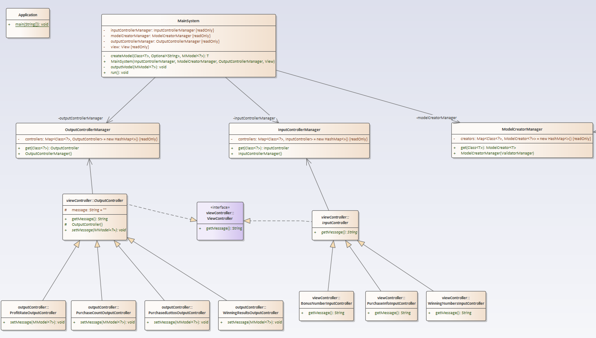
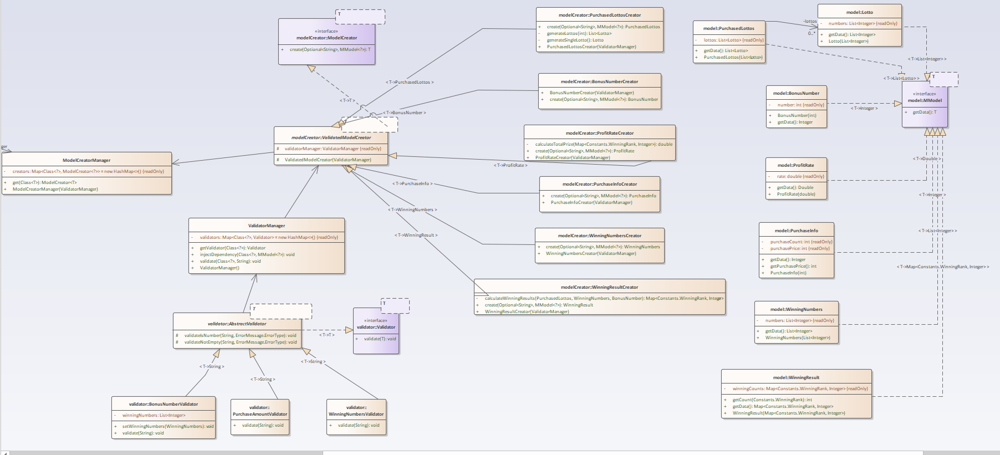

# 2주차 학습 내용

### 학습 내용
- MVC 패턴을 이용하여 로또 기능을 구현해봤습니다.

### 고민했던 점
- 인터페이스와 제네럴 기능을 이용하여 각 Controller들을 하나의 메서드를 통하여 사용하는 것을 목표로 하였습니다.
- 최대한 메인 시스템을 간략화하기 위해 노력했는데 메인 시스템에서 맡는 모델 생성과 뷰와의 상호작용을 각각 하나의 메서드로 수행할 수 있도록
 코드를 짰습니다.
- 그 과정에서 클래스가 너무 많이 생기진 않는지, 코드의 복잡성이 올라가진 않는지, 다른 사람들이 이해하기 쉽도록 작성했는지에 대한 고민을 했는데
 이 부분에 있어서는 부족함이 보이는 것 같습니다.
- 변수 명을 조금 더 직관적으로 정리할 필요가 있는 것 같습니다.

### 1주차와 비교하여 수정한점
- Validator를 다 분리하였습니다.
- View에는 input과 output 메서드 2개 만을 남기고 모두 Controller를 사용하여 처리하였습니다.
- Model은 데이터만을 담고 생성과 데이터 처리는 모두 Cotroller에서 처리하였습니다.
- 각 Controller들은 Manager를 생성하여 MainSystem에서 관리하도록하였습니다.

### 구조도

